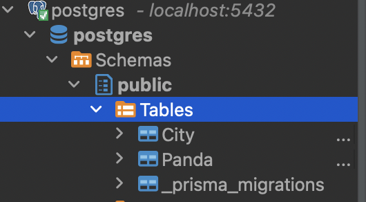
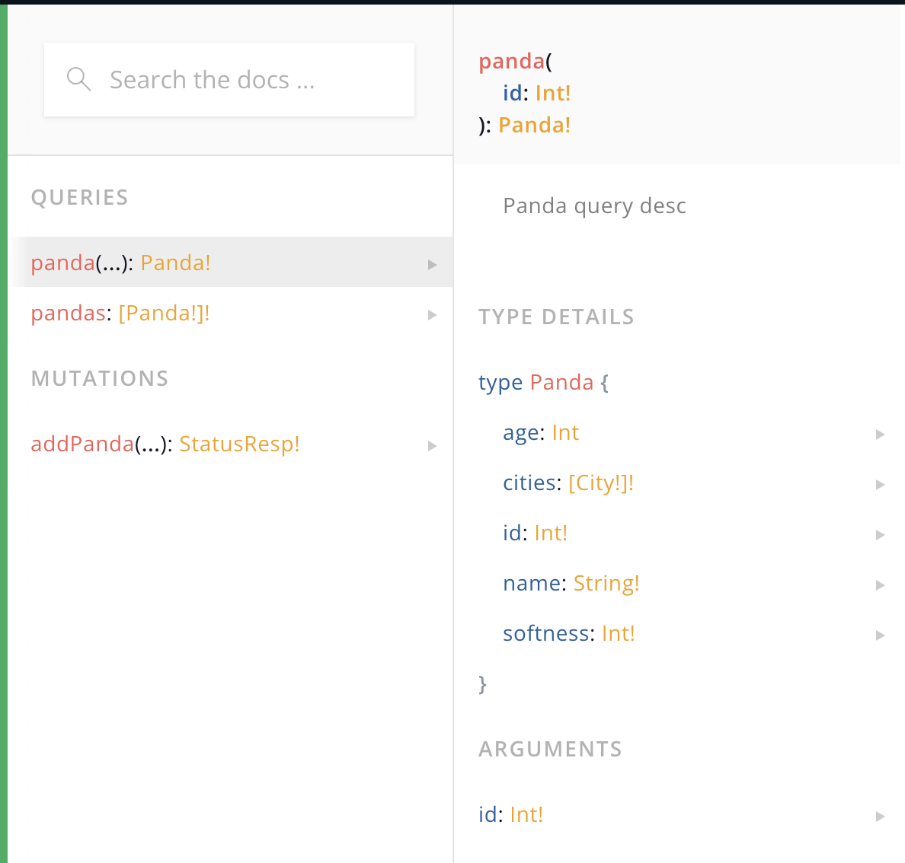

# Sample Rest API and GraphQL APIs built with Nest.js

## To start

1.  Create Postgres DB in Docker

```
docker run --name some-postgres -e POSTGRES_PASSWORD=mysecretpassword --rm -p 5432:5432 -d postgres
```
2. Create `.env` file based on `.env.demo` template (should contain connection string in `DATABASE_URL` variable)
3. Apply prisma migrations

```
prisma migrate dev --name init
```

PostgreSQL DB with the following structure will be created:



4. Start nest.js application:

```
npm run start
```
    
Or in watch mode:

```
npm run start:dev
```

### Rest API endpoints:

```
[Nest] 9169  - 07/10/2022, 2:49:26 PM     LOG [RouterExplorer] Mapped {/koalas, GET} route +1ms
[Nest] 9169  - 07/10/2022, 2:49:26 PM     LOG [RouterExplorer] Mapped {/koalas/first, GET} route +0ms
[Nest] 9169  - 07/10/2022, 2:49:26 PM     LOG [RouterExplorer] Mapped {/koalas/:id, GET} route +0ms
[Nest] 9169  - 07/10/2022, 2:49:26 PM     LOG [RouterExplorer] Mapped {/koalas, POST} route +0ms
```

### GraphQL schema:

